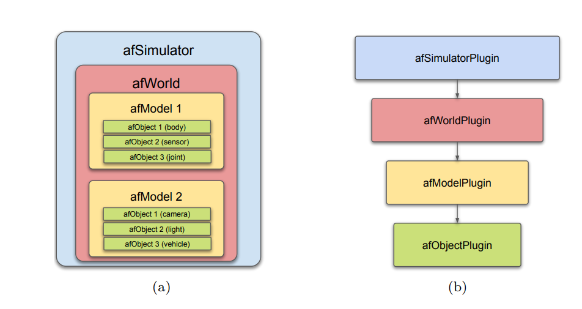

# EXAMPLE PLUGIN FOR AMBF ROS COMMUNICATION

## Description:
This repo is an example of a standalone object communication plugin that is built outside of the AMBF build tree. The plugin's source code is identical (other than class names) to the [AMBF Communication]("https://github.com/WPI-AIM/ambf/blob/ambf-2.0/ambf_plugins/core/ros_comm_plugin/ObjectCommPlugin.h") plugin. 


## Usage:

### Build:
1. Clone and build AMBF according to the instructions on its Readme.

2. Clone this repo

```bash
git clone <this_repo>
```
3. Build plugin
```bash
cd <path_to_this_folder>
mkdir build && cd build
cmake ..
make
```
This should build the object communication plugin.


### Launch:
In a terminal window
```
roscore
```

In another terminal window

```bash
ambf_simulator -a <path_to_this_folder>/ADF/test.yaml
```
The above command assumes that `ambf_simulator` is set as an alias or resides in `/usr/local/bin` (can a softlinkm i.e. `ln -s <path_to_ambf_simulator>`). If not, please use the full path to `ambf_simulator` which would be something like `~/ambf/bin/lin-x86_64/ambf_simulator`.


## Explanation:
Please take a look at the [ADF]("./ADF/test.yaml") file to see where the plugins are defined at object level scope. The contents are copied here, please check out the added comments. We have 3 different types of objects in this ADF file, and they all use the same object communication plugin. The plugin in this case looks at the object type and manages the relevant data fields, publishers, and subscribers.

```yaml
bodies:
- BODY Suzanne

lights:
- LightSuzi

cameras:
- CameraSuzi

joints: []

high resolution path: ./high_res/
low resolution path: ./low_res/
ignore inter-collision: true
namespace: /ambf/env/


BODY Suzanne:
  name: Suzanne
  mesh: Suzanne.STL
  collision mesh type: CONVEX_HULL
  mass: 1.0
  collision margin: 0.001
  scale: 1.0
  location:
    position:
      x: 0.0
      y: 0.0
      z: 0.0
    orientation:
      r: 0.0
      p: -0.0
      y: 0.0
  inertial offset:
    position:
      x: 0.0
      y: 0.0
      z: 0.0
    orientation:
      r: 0
      p: 0
      y: 0
  passive: true # This ignores the interal ROS comm plugin. Instead we will use the plugin below for communication
  color: random
  publish children names: false
  publish joint names: false
  publish joint positions: false
  friction:
    rolling: 0.0
    static: 0.5
  restitution: 0.1
  damping:
    angular: 0.1
    linear: 0.04
  visible: true
  collision groups: []
  plugins: [  # Here we define the plugin
    {
      name: external_ros_communication,
      path: "../build/.",
      filename: libros_comm_plugin.so
    },
  ]

LightSuzi:
  namespace: lights/
  name: Light_Suzanne
  location: {x: -2, y: -2, z: 5}
  direction: {x: 0, y: 0, z: -1.0}
  spot exponent: 0.3
  shadow quality: 0
  cutoff angle: .3
  passive: false # Same concept. Set as passive to prevent internal ROS Comm plugin
  plugins: [ # Same plugin. The plugin code handles the different object types
    {
      name: external_ros_communication,
      path: "../build/.",
      filename: libros_comm_plugin.so
    },
  ]


CameraSuzi:
  namespace: cameras/
  name: Camera_Suzanne
  location: {x: 2.0, y: 0.0, z: 2.0}
  look at: {x: 0.0, y: 0.0, z: 0.0}
  up: {x: 0.0, y: 0.0, z: 1.0}
  clipping plane: {near: 0.1, far: 10.0}
  field view angle: 0.8
  monitor: 0
  parent: BODY Suzanne
  passive: false # Set as passive, so this object won't show up in ROS Comm
#   plugins: [  # Have purposefully commented out the plugin to show that ROS comm by this plugin is not loaded
#     {
#       name: external_ros_communication,
#       path: "../build/.",
#       filename: libros_comm_plugin.so
#     },
#   ]

```

## Concepts:
Conceptually, the AMBF computational and plugin hierarchy is shown below:



Based on this hierarchy, the plugins are defined at the relevant scope in the ADF files, i.e. `launch.yaml` for Simulator plugins, `world.yaml` for World plugins, outmost scope in `model.yaml` for Model plugins, and within object data scope (or Object attributes) for Object plugins. This is shown in the image below:


## Further Reading and References:
Please take a look at these papers to understand the AMBF plugin pipeline and hierarchy.

1. Munawar, A., Li, Z., Nagururu, N., Trakimas, D., Kazanzides, P., Taylor, R.H. and Creighton, F.X., 2024. Fully immersive virtual reality for skull-base surgery: surgical training and beyond. International Journal of Computer Assisted Radiology and Surgery, 19(1), pp.51-59.


2. Munawar, A., Wu, J.Y., Fischer, G.S., Taylor, R.H. and Kazanzides, P., 2022. Open simulation environment for learning and practice of robot-assisted surgical suturing. IEEE Robotics and Automation Letters, 7(2), pp.3843-3850.